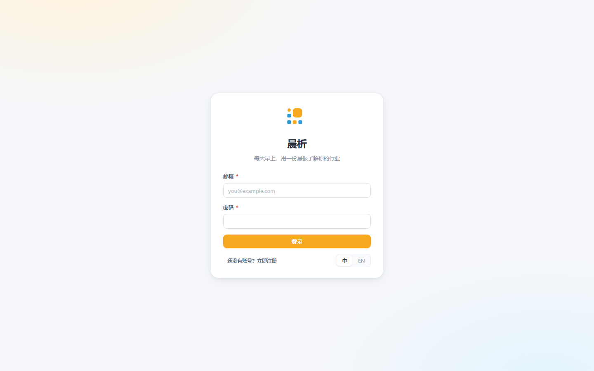
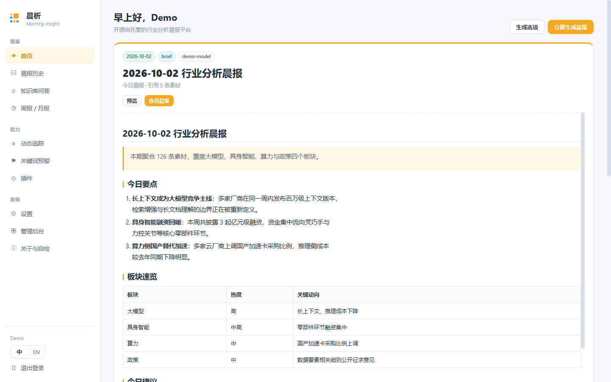
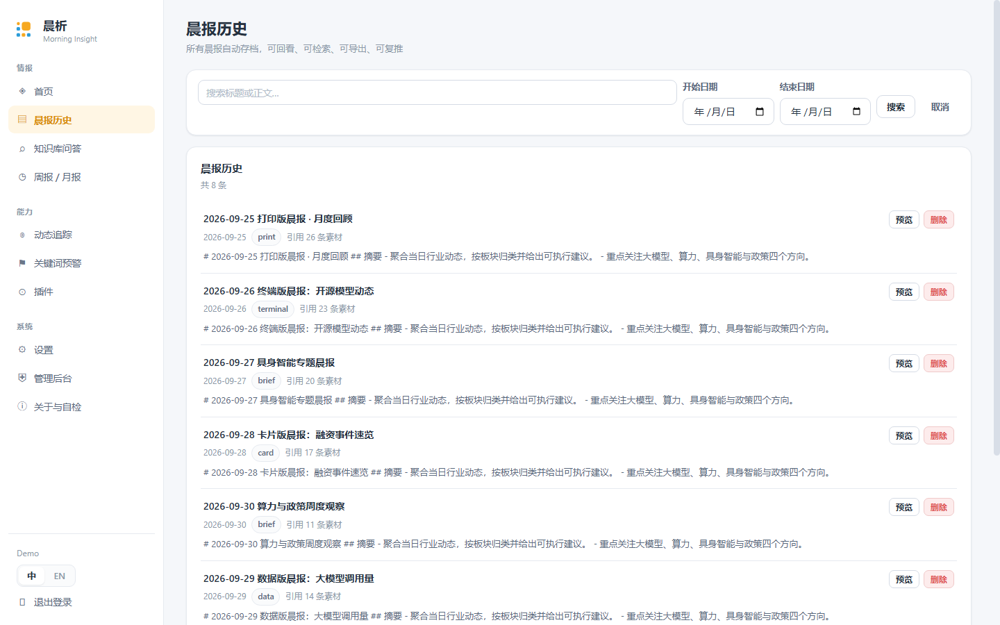
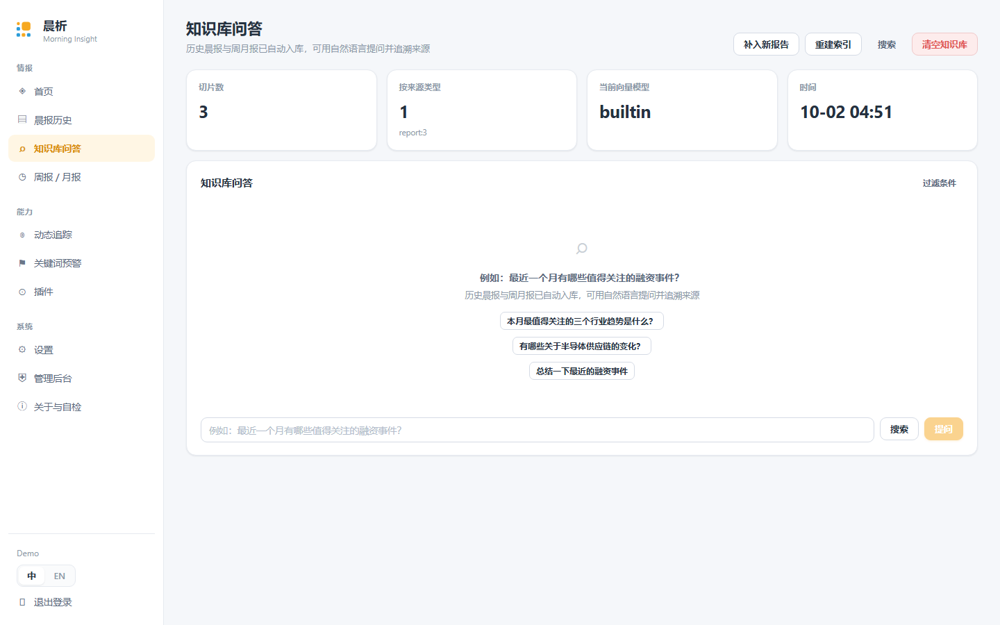
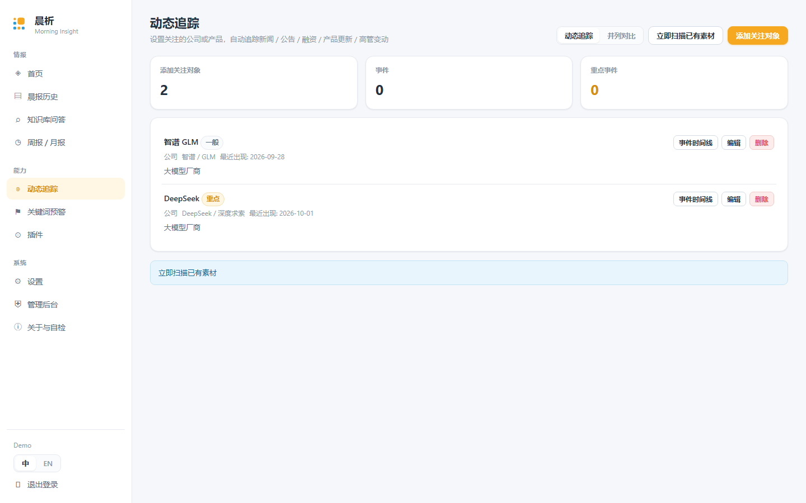
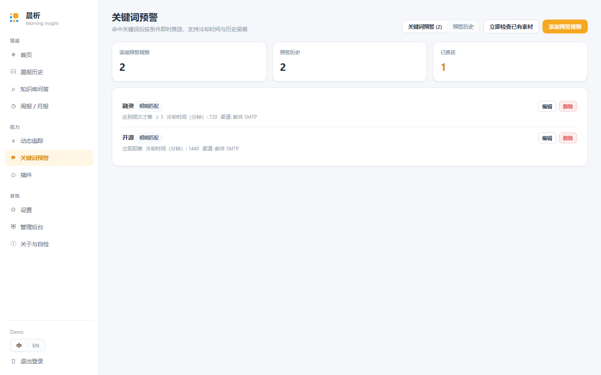
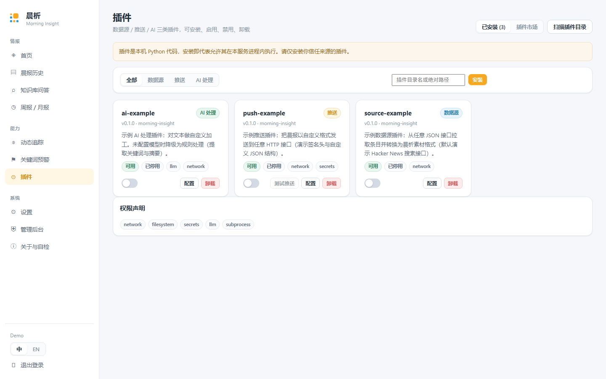
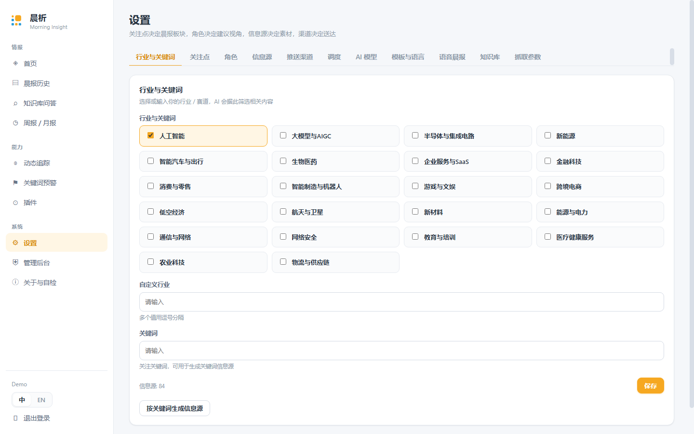

# Morning Insight · 晨析

<div align="center">  
    
  <p><b>Every morning, an industry briefing that actually understands you</b></p>  
  <p>Open source · Self-hosted · AI-powered · Multi-user</p>  
  <p>
    <a href="https://github.com/jialanouyang/morning-insight/releases"></a>
    <a href="https://github.com/jialanouyang/morning-insight/actions/workflows/ci.yml"></a>
    <a href="LICENSE"></a>
    
    
    
    
  </p>
  <p><b>If this project helps you, a ⭐ Star is the best way to help more people find it.</b></p>  
  <p>  
    <a href="https://morning-insight-demo.app.workbuddy.host/">Live Demo</a> ·  
    <a href="#quick-start">Quick Start</a> ·  
    <a href="#feature-overview">Features</a> ·  
    <a href="#directory-structure">Structure</a> ·  
    <a href="#configuration">Configuration</a> ·  
    <a href="docs/api.md">API</a> ·  
    <a href="docs/plugin-dev.md">Plugins</a> ·  
    <a href="README.md">简体中文</a>  
  </p>  
</div>

---

## Introduction

**Morning Insight** is an open-source, self-hosted industry briefing platform.

On a schedule you define, it collects Chinese and English material from sources matching your
industries, focus points and analyst roles, hands it to an LLM that writes a structured daily
briefing, and pushes it to email / WeCom / DingTalk / Feishu / Telegram / Slack / Discord and more.
Every issue is archived automatically, becomes searchable, and feeds a RAG knowledge base with
cited Q&A. On top of that: competitor tracking, keyword alerts, weekly & monthly digests,
audio briefings and a plugin system.

- **Your data stays yours** — everything runs on your own server; no third-party platform in the loop.
- **Any model** — works with any OpenAI-compatible endpoint (OpenAI / DeepSeek / Kimi / GLM / Qwen /
  SiliconFlow / local Ollama…).
- **Runs without an API key** — with no model configured it still produces a "raw material" edition,
  and the knowledge base falls back to built-in offline retrieval.
- **Multi-user isolation** — every user gets their own config, briefings, knowledge base,
  tracked competitors, alerts and schedules.

> **Live Demo**: https://morning-insight-demo.app.workbuddy.host/  
> Sign in with `demo@example.com` / `demo1234`. Registration and scheduled fetching are disabled
> in the demo environment.

## Feature Overview

### 1. Configuration

| Item | Details |
| --- | --- |
| Industries & keywords | 22 built-in industries (multi-select) + custom; keywords can be turned into keyword sources in one click |
| Focus points | 8 built-in: funding, policy & regulation, tech breakthroughs, competitor moves, talent, market data, competitive landscape, supply chain. Three levels of use — *tick to use → edit the built-in definition → fully custom*. **Whatever you tick becomes a section of the briefing** |
| Roles | 7 built-in templates: analyst, founder, PM, fundraising advisor, sales, investor, marketing. System prompts are visible and editable; supports custom roles and multiple roles per person |
| Sources | 84 tested sources enabled by default (RSS / API / web), 140 in the full catalog. Add one by one, add all, or build sources from search-engine indexing |
| Push channels | 13 channels shown by default — tick to expand config, each with a "test push" button |
| Schedule | Daily / weekdays / specific weekdays / custom cron; weekly and monthly digests have their own schedules |
| Languages | UI: 简体中文 / English; briefings: Chinese / English / bilingual, with optional auto-translation of foreign sources |
| Length | Brief (3–5 min) or detailed (10–15 min) |
| Models | 8 provider presets + any OpenAI-compatible endpoint, with optional custom extra prompt |

### 2. Data Fetching

- Priority chain: **RSS → API → web parsing → browser rendering fallback** (Playwright, optional).
- Sources are not picked by region — content relevance decides (keyword sources + AI classification).
- 4-stage deduplication: exact URL → title fingerprint → content fingerprint → content similarity
  (Jaccard + length penalty).
- Time window defaults to 24 h and is configurable; per-source item limits.
- Publish-date parsing covers numeric timestamps, Chinese dates, dates without a year, relative
  times (`3分钟前`), and dates embedded in URLs (`/20260929/`, `t20260731_xxx.html`) —
  patterns common on Chinese sites.
- A broken source fails on its own without affecting others; concurrent multi-threaded fetching.

### 3. AI Processing

- Per-item summaries and automatic classification (section / focus point / language / region / importance score).
- Role-based advice and multi-role perspectives (prompts centrally managed, all editable).
- Trend judgment, competitor-move detection, keyword-alert evaluation.
- Cost control: in-process result cache, tiered calls per scene, token & cost logged per use.

### 4. Briefing Generation & Translation

- **Dashboard focuses on today** — today's briefing is the visual centerpiece with full content;
  recent briefings sit below as a list.
- **6 templates**: brief, magazine, data, card, terminal, print — each with its own layout,
  palette and writing style.
- Advanced users can write custom HTML/CSS templates (placeholders `{{title}}`, `{{content}}`,
  `{{accent}}`, `{{css}}`).
- Export to **Markdown / HTML / PDF / image**; the archive is searchable (title + body + date range).
- **One-click translation (translations keep the original structure and layout)**:
  - Entry points: the today card and recent list on the dashboard, the preview dialog, and the
    briefing detail page.
  - Flow: translating → retry on failure → toggle between original and translation; translated
    text carries a "translated" tag.
  - The button only appears **when the briefing language differs from the UI language**
    (e.g. reading an English briefing in the Chinese UI).
  - Translations are cached per (briefing × target language) — repeat views never call the model again.

### 5. Push

| Group | Channels |
| ----- | -------- |
| General | Email (SMTP), Web Push (VAPID), generic webhook (custom method / auth headers / JSON template) |
| CN IM | WeCom bot, DingTalk bot (signed), Feishu bot (signed + cards) |
| Global IM | Telegram bot (voice notes supported), Slack, Discord |
| WeChat relays | ServerChan, PushPlus |
| Mobile | Bark (iOS) |

Channel failures are isolated — one broken channel never blocks the others, and everything is
logged and traceable in the admin console.

### 6. Knowledge Base (RAG)

- Briefings and digests are ingested automatically: chunking → embedding → vector store.
- Natural-language Q&A with citations back to the source report; filter by time and industry.
- Pure retrieval mode (no LLM call — quickly locate passages).
- 5 embedding options (auto / OpenAI / Zhipu / BGE / built-in offline).
- 4 vector stores: built-in (SQLite + cosine) / Chroma / Qdrant / pgvector.

### 7. Competitor Tracking & Keyword Alerts

- **Tracking**: follow companies or products; events (news / announcements / funding / product
  updates / exec changes) are recognized automatically, become a dedicated briefing section, and
  build a per-target timeline with side-by-side comparison.
- **Alerts**: exact / fuzzy matching; fire on first hit, on frequency, or only from key sources;
  cooldown windows, per-alert channels, and a full alert history.

### 8. Digests · Audio · Plugins

- **Weekly / monthly digests**: generated automatically (Mon / 1st) or on demand, with period
  overview, per-section summaries, trends and delta vs. previous period.
- **Audio briefings**: Edge TTS (free, many voices) / OpenAI TTS, output MP3 or OGG
  (Telegram voice notes), pushed alongside the briefing.
- **Plugin system**: three kinds (source / push / AI processing). `plugin.yaml` declares metadata,
  permissions and config schema; install / enable / disable / uninstall + marketplace.
  Three example plugins ship with the repo.

### 9. Users & Permissions

- Email sign-up / login (PBKDF2 hashing + JWT); self-registration can be disabled.
- Full multi-user data isolation; admin and regular roles.
- Admin console: user management, system stats, push logs, scheduled jobs, model usage.

## Screenshots

| Login | Dashboard |
| -- | -- |
|  |  |

| Briefings | Knowledge Q&A |
| ---- | ----- |
|  |  |

| Tracking | Alerts |
| ---- | ----- |
|  |  |

| Plugins | Settings |
| -- | -- |
|  |  |

> Screenshots of digests, the admin console and the About/self-check page are in
> [`docs/screenshots/`](docs/screenshots/). All screenshots use demo data — no real accounts or keys.

## Requirements

| Component | Version | Notes |
| --------- | ------- | ----- |
| Python | 3.10+ (3.12 recommended) | Backend |
| Node.js | 18+ (20 recommended) | Frontend build & dev server |
| Docker / Compose | optional | one-command deploy |
| Database | SQLite (default) / PostgreSQL | switch via `DATABASE_URL` |

## Quick Start

### Option 1: Docker Compose (recommended)

```bash
git clone https://github.com/jialanouyang/morning-insight.git morning-insight
cd morning-insight

# (optional) copy deploy config; change SECRET_KEY in production
cp backend/.env.example backend/.env
# python -c "import secrets;print(secrets.token_urlsafe(48))"

docker compose up -d
```

Open `http://localhost:8080`, register (the **first user automatically becomes admin**), then:

1. **Settings → AI Model**: fill in base URL / API key / model, click "Test connection".
2. **Settings → Industries, Focus points, Roles, Sources**: adjust as needed (defaults work out of the box).
3. **Settings → Push channels**: tick channels, fill in params, click "Test push".
4. Back on the **dashboard**, click "Generate briefing now".
5. To run it automatically: **Settings → Schedule**, enable and pick a frequency and time.

### Option 2: Manual / local development

**Backend**:

```bash
cd backend
python -m venv .venv && . .venv/bin/activate    # Windows: .venv\Scripts\activate
pip install -r requirements.txt
cp .env.example .env                            # change SECRET_KEY
uvicorn app.main:app --reload --port 8000
```

Optional extras (everything works without them; code detects and degrades automatically):

```bash
pip install -r requirements-optional.txt
playwright install chromium   # only for JS-rendered fetching / image export
```

**Frontend**:

```bash
cd frontend
npm install
npm run dev      # http://localhost:5173 — /api is proxied to 127.0.0.1:8000
npm run build    # outputs frontend/dist
```

> The dev proxy targets `127.0.0.1:8000` by default; override with the `API_TARGET` env var.

**Demo data (optional)**: seeds the demo account `demo@example.com / demo1234` and one sample briefing.

```bash
cd backend
python scripts/seed_demo.py
```

## Directory Structure

```
morning-insight/
├── backend/
│   ├── app/
│   │   ├── main.py                 # entry: CORS, auto-migration, scheduler, capability check
│   │   ├── settings.py             # env-var config (with defaults)
│   │   ├── database.py             # engine / session / Base
│   │   ├── models.py               # 16 tables
│   │   ├── migrate.py              # lightweight auto-migration (ALTER TABLE ADD COLUMN)
│   │   ├── security.py             # PBKDF2 + JWT + role checks
│   │   ├── ai/                     # catalog (focus points/roles/templates/industries/providers), llm, prompts
│   │   ├── fetcher/                # rss, api_source, web_source, browser, dedup, catalog, service
│   │   ├── report/                 # render (6 themes), export (md / html / pdf / image)
│   │   ├── push/                   # base (channel registry), dispatcher, channels/ (13 channels)
│   │   ├── plugins/                # base (manifest validation), loader, registry
│   │   ├── routers/                # 10 router modules (auth / config / report / knowledge / …)
│   │   ├── services/               # pipeline, scheduler, knowledge, competitor, alert,
│   │   │                           # periodical, tts, translation, i18n
│   │   └── utils/text.py           # cleaning, fingerprints, similarity, language detection
│   ├── tests/                      # test_api.py, test_fetcher.py (74 tests, no network)
│   ├── scripts/seed_demo.py        # demo account + sample briefing
│   ├── requirements.txt            # core dependencies
│   ├── requirements-optional.txt   # playwright / pywebpush / chromadb etc.
│   ├── requirements-dev.txt        # test dependencies
│   ├── .env.example                # deployment config sample
│   └── Dockerfile
├── frontend/
│   ├── src/
│   │   ├── pages/                  # Login, Dashboard, Reports, Knowledge, Competitors,
│   │   │                           # Alerts, Periodicals, Plugins, Settings, Admin, About
│   │   ├── components/             # ui.jsx, Toast, Markdown, ReportTranslate, Logo
│   │   ├── i18n/                   # react-i18next + zh / en bundles (local, offline)
│   │   ├── api.js                  # every backend endpoint (auto token, 401 → login)
│   │   ├── store.js                # shared state: meta / current user / config
│   │   ├── App.jsx                 # routes & layout
│   │   └── styles.css              # design system (orange #F6A821 / blue #2B9CD8)
│   ├── public/                     # logo.svg, sw.js (Web Push)
│   ├── Dockerfile + nginx.conf     # production image & reverse proxy
│   └── package.json
├── plugins/                        # 3 example plugins: source / push / ai
├── scripts/
│   ├── seed_demo.py                # demo data (via HTTP API, incl. competitors & alerts)
│   └── shot.cjs                    # screenshot script (Chrome DevTools Protocol)
├── docs/
│   ├── api.md                      # REST API reference
│   ├── plugin-dev.md               # plugin development guide
│   └── screenshots/                # UI screenshots
├── config.example.yaml             # every config key, annotated
├── docker-compose.yml
├── .github/workflows/ci.yml        # CI: backend tests + frontend build
├── CONTRIBUTING.md
├── LICENSE                         # Apache License 2.0
└── README.md
```

### Architecture

```
┌───────────────────────────────────────────────────────────────┐
│  React 18 + Vite  ── /api ──▶  FastAPI + SQLAlchemy 2.0       │
├───────────────────────────────────────────────────────────────┤
│  Fetch     fetcher/   RSS · API · web · plugins · browser     │
│  Dedup     dedup.py   URL → title fp → content fp → similarity│
│  AI        ai/        prompt factory · LLM adapter · embed    │
│  Render    report/    6 templates · MD→HTML · PDF / image     │
│  Push      push/      13 channels · registry-driven · isolated│
│  Services  services/  pipeline · scheduler · knowledge ·      │
│                      competitor · alert · periodical · tts ·  │
│                      translation                               │
│  Plugins   plugins/   manifest · dynamic loading · lifecycle  │
│  Schedule  APScheduler (per-user jobs + digest jobs)          │
│  Storage   SQLite (or PostgreSQL) · built-in vector search    │
└───────────────────────────────────────────────────────────────┘
```

## Configuration

### Deployment level (environment variables)

Copy `backend/.env.example` to `backend/.env` and adjust:

| Variable | Default | Notes |
| -------- | ------- | ----- |
| `SECRET_KEY` | `dev-secret-do-not-use-in-production` | JWT signing key — **must be a long random string in production** |
| `DATABASE_URL` | `sqlite:///./data/morning_insight.db` | any SQLAlchemy URL; PostgreSQL works |
| `TOKEN_EXPIRE_HOURS` | `72` | login token lifetime |
| `TIMEZONE` | `Asia/Shanghai` | scheduler timezone |
| `DATA_DIR` | `./data` | database, audio and export directory |
| `ALLOW_REGISTRATION` | `true` | self-registration switch (the first user can always register and becomes admin) |
| `PLUGIN_INSTALL_ENABLED` | `true` | allow installing plugins from the UI; plugins are local Python code — disable on public deployments |
| `PLUGIN_DIR` | `<repo>/plugins` | plugin directory |

Frontend dev variables:

| Variable | Default | Notes |
| -------- | ------- | ----- |
| `API_TARGET` | `http://127.0.0.1:8000` | backend address for the Vite dev proxy |

### User level (in-app Settings)

AI model, sources, push channels, TTS, knowledge base and fetch parameters are all
**per-user configuration**: each user has their own, keys live only in the local database —
never in deploy config, never in the repo. See [`config.example.yaml`](config.example.yaml)
for every field.

### AI providers (any OpenAI-compatible endpoint)

| Provider | Base URL | Example model |
| -------- | -------- | ------------- |
| OpenAI | `https://api.openai.com/v1` | `gpt-4o-mini` |
| DeepSeek | `https://api.deepseek.com/v1` | `deepseek-chat` |
| Moonshot Kimi | `https://api.moonshot.cn/v1` | `moonshot-v1-8k` |
| Zhipu GLM | `https://open.bigmodel.cn/api/paas/v4` | `glm-4-air` |
| Qwen | `https://dashscope.aliyuncs.com/compatible-mode/v1` | `qwen-plus` |
| SiliconFlow | `https://api.siliconflow.cn/v1` | `Qwen/Qwen2.5-7B-Instruct` |
| Ollama (local) | `http://host.docker.internal:11434/v1` | `qwen2.5:7b` |

## Data & Privacy

- **The local data directory never enters the repo** — `DATA_DIR` (default `backend/data/`)
  holds the SQLite database, audio files and exports, and is excluded by `.gitignore`.
  It is created automatically on first start.
- **Keys never touch code** — AI keys and push tokens live only in the local `user_configs`
  table and are masked in API responses. Every example in the repo is a placeholder
  (`you@example.com`, `change-me-to-a-random-secret-string`).
- **Pre-deploy checklist** — change `SECRET_KEY`; on public deployments set
  `ALLOW_REGISTRATION=false` and `PLUGIN_INSTALL_ENABLED=false`; mind file permissions on
  the database and backups.
- **Screenshots & docs** — repo screenshots use demo data; no real accounts, emails or keys.

## Tests

```bash
cd backend
pip install -r requirements-dev.txt
pytest -v
```

**74 tests** (`test_api.py` 42 + `test_fetcher.py` 32), none requiring internet or real keys:

- Auth & permissions: first user becomes admin, duplicate registration, weak passwords,
  token checks, 403 on admin endpoints, multi-user isolation.
- Config round-trips: key masking & write-back, per-section read/write, resets, channel test errors.
- Full pipeline: fetch → AI generation → storage → list → detail → export (md / html / pdf),
  with the AI mocked in-test.
- Knowledge base ingest / search / Q&A / re-index; competitor, alert and digest CRUD + scans.
- Plugin discovery, enable/disable, marketplace; admin stats, scheduled jobs, push logs, model usage.
- Fetcher: time-window filtering, broken-source tolerance, 4-stage dedup, catalog integrity.

Frontend build check:

```bash
cd frontend && npm run build
```

## FAQ

**Q: I can't find the "translate" button.**  
It only appears when the briefing language differs from the UI language. Reading a Chinese
briefing in the Chinese UI hides it; switch the UI to English and the button shows up in the
dashboard (today card, recent list, preview dialog) and on the briefing detail page. The
briefings *list* has no entry — open a briefing first.

**Q: Can I use it without a model API key?**  
Yes. With no model configured you get a structured "raw material" edition and offline knowledge
retrieval; configure a model later and it upgrades to full briefings automatically.

## Contributing

Issues and pull requests are welcome — see [CONTRIBUTING.md](CONTRIBUTING.md).

## Roadmap

- [x] Configuration (focus points / roles / sources / channels / models)
- [x] Fetching (RSS / API / web / plugin sources) + 4-stage dedup
- [x] AI processing (summaries / classification / role advice / trends / tracking / alerts)
- [x] Briefing generation (6 templates + custom HTML/CSS, 4 export formats)
- [x] One-click translation (layout-preserving, cached per language)
- [x] Push (13 channels, failure isolation, test push)
- [x] Knowledge base RAG (auto-ingest / semantic search / Q&A with citations)
- [x] Competitor tracking, keyword alerts, weekly/monthly digests
- [x] Plugin system (with marketplace and 3 examples)
- [x] Audio briefings (Edge TTS / OpenAI TTS)
- [x] Multi-user & permissions, admin console
- [ ] Better mobile layout
- [ ] Team-shared source & template libraries

## Star History

If Morning Insight helps you, a ⭐ **Star** is the best way to help more people find it —
and it keeps the project maintained.

- Problems or feature ideas → [open an issue](https://github.com/jialanouyang/morning-insight/issues)
- Want to contribute → see [CONTRIBUTING.md](CONTRIBUTING.md)

## License

[Apache License 2.0](LICENSE)
